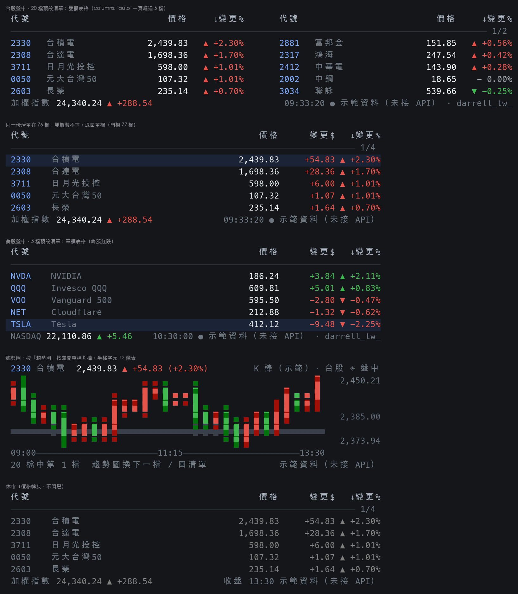

# tw-stock-mod

A stock watchlist band above the Claude Code prompt, in the style of a broker's
watchlist table. **Taiwan trading hours show the Taiwan list, US trading hours
show the US list**, and the red/green convention flips with the market:
台股紅漲綠跌、美股綠漲紅跌. Price is the main column. A watchlist over five
symbols draws two side by side instead of scrolling, and the 趨勢圖 button
swaps the table for one symbol's K bars.



**Both markets are live, each from its own source, and the footer says which.**
Both read Yahoo's public endpoints by default (`Yahoo 即時` for the US,
`Yahoo 延遲` for Taiwan, since Yahoo's Taiwan quotes run about twenty minutes
behind) — no key and no account either way. Set `"twSource": "mis"` to read
Taiwan from the exchange's own real-time intraday endpoint instead
(`證交所 即時`). A market the feed cannot reach falls back to a deterministic
sine walk off each symbol's previous close and the footer says
`示範資料（未接 API）`, so the tag always tells you what you are looking at.
See [The live feed](#the-live-feed).

Layout, colors and badges are ported from
[`prototype/stock-band-demo.py`](prototype/stock-band-demo.py) — read that
first if the numbers in `hooks/board.tsx` look arbitrary.

## Requirements

- Claude Code 2.1.269 or later, with `CLAUDE_CODE_ENABLE_FUNCTION_HOOKS=1` set
  in `~/.claude/settings.json`:

  ```json
  { "env": { "CLAUDE_CODE_ENABLE_FUNCTION_HOOKS": "1" } }
  ```

  (Merge the `env` key if the file already has one.)
- An interactive terminal. The band is `AbovePrompt`, so nothing draws in
  `claude -p`, the desktop app or mobile.

## Install

```sh
claude plugin marketplace add darrell-tw/darrelltw-mods
claude plugin install tw-stock-mod@darrelltw-mods
```

Restart Claude Code and the band appears above the prompt.

Or try it for one session without installing:

```sh
git clone https://github.com/darrell-tw/darrelltw-mods.git
CLAUDE_CODE_ENABLE_FUNCTION_HOOKS=1 claude --plugin-dir darrelltw-mods/mods/tw-stock-mod
```

To remove it:

```sh
claude plugin uninstall tw-stock-mod
claude plugin marketplace remove darrelltw-mods
```

## What the band shows

The built-in Taiwan watchlist is 20 symbols, so the two-column table is what a
fresh install actually shows for Taiwan:

```
 台股 ▾  ☀ 盤中 09:00-13:30                    [翻頁 1/2] [趨勢圖] [收起 30分]
 代號              價格    變更%     代號              價格    變更%
 ──────────────────────────────────────────────────────────────────
 2382   廣達      341.56  ▲ +2.57%   2891   中信金      70.06  ▲ +0.52%
 2330   台積電  2,423.04  ▲ +1.59%   2412   中華電     143.95  ▲ +0.31%
 3711   日月光投控 599.88 ▲ +1.33%   1301   台塑         62.13  ▲ +0.21%
 2603   長榮      235.81  ▲ +0.99%   2002   中鋼         18.67  ▲ +0.11%
 0050   元大台灣50 107.16 ▲ +0.86%   006208 富邦台50    243.67  ▲ +0.07%
 加權指數 46,143.02 ▲ +280.50               13:12:25 ● Yahoo 延遲 · darrell_tw_
```

The built-in US watchlist is 20 symbols too, so it draws the same two-column
table (this one is the real board fed by Yahoo, US session closed):

```
 美股 ▾  ☾ 休市 下次開盤 09:30 ET            [翻頁 1/2] [趨勢圖] [收起 30分]
 代號                           價格     ↓變更%       代號                           價格     ↓變更%
 ────────────────────────────────────────────────────────────────────────────────────────────── 1/2
 CRWD   CrowdStrike           242.49   ▲ +3.02%       MU     Micron                927.60   ▲ +0.39%
 AMD    AMD                   504.20   ▲ +2.19%       PLTR   Palantir              172.56   ▼ -0.43%
 ARM    Arm                   241.83   ▲ +1.18%       VOO    Vanguard 500          696.20   ▼ -0.44%
 META   Meta                  670.24   ▲ +0.70%       AAPL   Apple                 331.34   ▼ -0.52%
 NVDA   NVIDIA                212.17   ▲ +0.57%       QQQ    Invesco QQQ           704.54   ▼ -0.65%
 NASDAQ  25,981.57 ▼ -204.84                    收盤 16:00 · 30s Yahoo 即時 · darrell_tw_
```

Cut the list to five symbols, or set `"columns": 1`, and the same board draws
the single-column table instead — that one keeps the 變更$ column and the
highlighted top mover:

```
 美股 ▾  ☾ 休市 下次開盤 09:30 ET                        [趨勢圖] [收起 30分]
 代號                          價格      變更$   變更%
 ──────────────────────────────────────────────────
 TSLA    Tesla                366.33     +0.89 ▲ +0.24%
 QQQ     Invesco QQQ          715.56     +0.68 ▲ +0.10%
 NVDA    NVIDIA               218.28     -0.01 ▼ -0.00%
 VOO     Vanguard 500         699.16     -3.40 ▼ -0.48%
 NET     Cloudflare           304.77     -1.76 ▼ -0.57%
 NASDAQ 26,306.53 ▼ -26.51                  收盤 16:00 Yahoo 即時 · darrell_tw_
```

- **The title row is the market button.** `台股 ▾` / `美股 ▾` names the market
  ON THE BAND, and nothing else — two markets, two labels. A session starts
  on the clock's pick and keeps tracking it until you press; the press shows
  the other market, and after that the button just toggles the two. (There is
  no third "auto" stop on the cycle: pressing into it would redraw the same
  board and read as a dead button, and `"market": "auto"` in the config is
  what puts a fresh session back on the clock.) The session state (`☀ 盤中` orange /
  `☾ 休市` blue), the hours, and — when there is room — the same hours restated
  in Taipei time sit next to it. `翻頁` / `趨勢圖` / `收起 30 分` stay
  right-aligned in the same row. **In the trend view the row changes**: the
  session state and hours step aside (the chart draws its own title with both
  on it) and `◀ 上一檔` / `下一檔 ▶ n/N` / `回清單` take that space, left-
  aligned beside the market button — next to the symbol they move through,
  rather than across the terminal from it. **No hotkeys**: a letter hotkey only fires
  once a Button already holds the focus ring, which buys nothing over Enter,
  and a digit hotkey would eat a prompt that starts with that digit — every
  button here is a click, or focus then Enter.
- **8 rows below that** in the table (header, rule, five quote rows, footer);
  the chart view keeps its own 9, title included, since that title names the
  symbol being charted rather than the market. **Price gets the widest,
  brightest column** in the single-column table, with its own breathing room;
  change$ and change% are right-anchored after it, capped at column 74. Under
  ~46 columns the name goes too.
- **Two columns once the watchlist holds more than five symbols** — `columns` in
  the config controls it (see [Configure](#configure)). Each half only carries
  代號/名稱/價格/變更% (變更$ has no room next to a second symbol), filled
  column-major off the current sort: the left half is ranks 1–5 on the page,
  the right half ranks 6–10, so the biggest gainers head the left column and
  the biggest fallers end the right one under the default change% sort. A
  6-column gutter separates the halves so 變更% and the next 代號 do not read
  as one run of digits, and the two-column table caps at 104 columns (the
  single-column one caps at 74). **Below 77 columns it falls back to the
  single-column table instead of squeezing** — a half needs at least 35
  columns (代號 + a name + 價格 + 變更%; see `MIN_HALF_WIDTH` in
  `hooks/board.tsx`), and two of those plus the gutter is 76 out of
  `width - 1`.
- **Rows are sorted by change%** (hence `↓變更%` in the header); the biggest
  mover gets the highlighted row in the single-column table. Two-column mode
  drops the highlight — a row there can hold two unrelated symbols, so there
  is no single "this row" to stripe. `"sort": "list"` keeps your own order.
- **Closed**: prices go gray, the blink stops, and the header reads
  `休市 下次開盤 09:00` with `收盤 13:30` on the right. Outside both sessions the
  band keeps showing the market that closed **most recently** — its closing
  prices are the news right after 13:30 — until the other market is within an
  hour of opening.
- **The footer's right end** is the clock — bare while the market is open
  (`13:12:25`), since its place on the row already says it is live; `收盤
  13:30` once it closes — its live dot, the countdown to the next feed
  request, the source tag, and the credit sign-off, in that order. A narrow
  row drops the least essential piece first: the countdown, then the credit,
  then the clock and dot, always keeping the source tag — knowing what prices
  you are looking at matters more than anything else here.

## The trend view (K bars)

```
 台股 ▾  ◀ 上一檔  下一檔 ▶ 2/10  回清單                        [收起 30分]
 2330 台積電  1,188.29 ▲ +23.29 (+2.00%)           K 棒（示範）· 台股 ☀ 盤中
 ▀▄          ▄▀▀▀▀▄          ▄▀▄▀▀          ▄▄▀▄▀▄          ▄▀▀   1,190.77
  ...candles, one per two columns, red/green by bar direction...
 09:00────────────────────────11:15───────────────────────13:30
 10 檔中第 2 檔                                    示範資料（未接 API） · darrell_tw_
```

Same 9 rows as the button row draws it into, one symbol's candles instead of
the table — this view keeps its own title row, since the line names the
symbol rather than the market. The plot is 6 terminal rows of **12 pixel
rows**: each cell packs two pixels as a half-block (`▀` with the top pixel as
foreground and the bottom as background) — and unlike braille, those glyphs
are everywhere. Body color
follows the market's convention (a bar that closed above its open is red on
the Taiwan board), wicks are the same hue darkened, and the previous close is
a faint horizontal reference line. The right edge carries high / previous
close / low; the axis under the plot is the session's own clock.

Bars come from the quotes file (`bars`), so with no feed connected the chart
draws demo bars and says so in the title. Only the focused symbol's bars are
sent to the board, which is why moving through the list is a button press
rather than a scroll.

**Three buttons, one job each.** `◀ 上一檔` and `下一檔 ▶` step through the
symbols on the current page and wrap around at both ends; `回清單` leaves.
They replace a single `趨勢圖` button that used to mean all three things at
once — enter the view, step forward, and fall out to the table on the last
symbol — which left no way back to the symbol you had just passed and no exit
except walking to the end of the list.

## Configure

Everything has a default; the band works with no config at all. To change the
watchlist, copy [`stock-band.example.json`](stock-band.example.json) to
`<project>/.claude/stock-band.json`:

| key | default | meaning |
| --- | --- | --- |
| `market` | `"auto"` | the state a session starts in: `auto` picks by the clock and keeps tracking it until the market button is pressed; `tw`/`us` opens on that market instead |
| `refreshMs` | `3000` | how often the module rebuilds the snapshot (min 1000; fixed at session start — changing it needs `/reload-plugins`) |
| `sort` | `"change"` | `change` = by change% desc, `list` = your order |
| `highlight` | `true` | highlight the biggest mover's row (single-column table only) |
| `columns` | `"auto"` | how many symbols a row draws: `auto` = 1 when the watchlist is 5 symbols or fewer, 2 for 6 or more; `1`/`2` force it (the board still falls back to 1 if the terminal is too narrow — see [What the band shows](#what-the-band-shows)) |
| `feed` | `"auto"` | `auto` prices whichever market is on the band; `both` keeps the other side warm; `tw`/`us` pins one; `off` = demo prices only |
| `twSource` | `"yahoo"` | `yahoo` = Yahoo (~20 min behind Taiwan, but one request whatever the list length); `mis` = 證交所 intraday (real time) |
| `feedMs` | `30000` | seconds between feed requests, in ms (floor 15000 — below that Yahoo answers 429; the request budget can widen it further) |
| `pageMs` | `10000` | how long one page holds before the board turns, in ms (floor 4000; `0` turns auto-paging off and leaves `翻頁` as the only way to page). Pressing `翻頁` restarts this countdown |
| `tw` / `us` | built-in lists | `{ code, name, prevClose }` per symbol; only `code` is required. Taiwan 上櫃 symbols need `"ex": "otc"` (e.g. 6488 環球晶) |
| `twIndices` | TAIEX / SEMI / FINANCE / SHIPPING | which indices the footer flaps through on the Taiwan board — see [Picking your own Taiwan indices](#picking-your-own-taiwan-indices). `mis` route only |

Both built-in lists are 20 symbols, so `columns` resolves to 2 and each page
holds 10 (a single-column page holds 5). Past that the watchlist pages, and
`翻頁` / the rule's page tag only show up once there is a second page.

**Pressing `翻頁` restarts the auto-page countdown.** The page clock is a
deadline measured from when the current page arrived, not an interval ticking
on its own — an interval cannot be reset, so pressing the button 9.9 s into a
10 s interval used to leave the page you asked for on screen for 100 ms before
the interval fired and took it away. The check rides the `refreshMs` poll
rather than owning a timer, so an automatic turn lands up to `refreshMs` after
its deadline: with the defaults, a page holds 10–13 s instead of exactly 10.

## The live feed

The module fetches quotes itself, through `$.http.fetch`, on its own clock
(`feedMs`, default 30 s) separate from the redraw poll (`refreshMs`, 3 s).
Under the default `feed: "auto"` only the market on the band costs a request,
and pressing the market button fetches the market you land on straight away
instead of leaving it on demo prices until the next tick.

- **US: two requests per tick with the built-in list.** Yahoo's `spark`
  endpoint answers every symbol on the board plus `^DJI`/`^GSPC`/`^IXIC` in a
  single call: last price, previous close, and the day's regular-market
  numbers. Past 20 symbols Yahoo answers `Number of symbols needs to be less
  than or equal to 20`, so the built-in 20-symbol list plus its three indices
  is 23 and splits into two requests — `fetchSpark` batches every call at 20
  symbols for exactly this reason. Two requests a tick puts the budget floor
  at 24 s, still under the 30 s default `feedMs`, so nothing slows down unless
  you set `feedMs` below 24000. Cut the list to 17 and it is one request
  again.
- **Taiwan: Yahoo by default, same batching as the US route.** The built-in
  20-symbol list plus its index is 21 symbols, so it costs two requests a
  tick the same way a 20-symbol US list would. Yahoo's Taiwan quotes are about
  twenty minutes old (measured 2026-09-16: Yahoo said 10:29:05 while 證交所
  MIS said 10:48:36).
- **Taiwan: `"twSource": "mis"` for the exchange's own real-time feed, one
  request whatever the list length.** `mis.twse.com.tw` answers the whole
  watchlist plus 加權指數 (`t00`) and 櫃買指數 (`o00`) in one call, with the
  real last trade behind it, and has no 20-symbol batching cap of its own.
  Two MIS fields need care: `z` reads `-` between trades, so the last actual
  deal comes from `trade.z`, and 上櫃 symbols answer on the `otc_` channel
  rather than `tse_`.
- **K bars cost extra, so they are fetched only when the chart view wants
  them** — one request for the one symbol it is drawing. MIS carries no K
  bars at all, so the chart view always goes to Yahoo per symbol, whichever
  `twSource` prices the table.
- **Rate limits are real.** A request with no browser `User-Agent` gets 429 on
  the first try, and the ban lasts minutes. Every non-2xx doubles the wait, up
  to 5 minutes.
- **Repeated URLs come back cached** — measured: six ticks over 80 seconds
  returned a byte-identical body and a frozen price — so every request carries a
  `_=<timestamp>` and no-cache headers.
## Picking your own Taiwan indices

The Taiwan footer ships with four: **TAIEX** (加權指數), **SEMI** (半導體類),
**FINANCE** (金融保險類) and **SHIPPING** (航運類) — the headline number plus
the three sectors that move Taiwan on any given day. They rotate, 5 seconds
each, so one lap is 20 seconds.

Replace the whole list with `twIndices` in your config:

```json
{
  "twSource": "mis",
  "twIndices": [
    { "code": "t00", "name": "TAIEX" },
    { "code": "t24", "name": "SEMI" },
    { "code": "TW50", "name": "TW50" },
    { "code": "o00", "name": "TPEx", "ex": "otc" }
  ]
}
```

**The first entry is the headline index** — the one the rest of the band reads
the market by. `ex` defaults to `tse`; 櫃買 (`o00`) is the one that needs
`"ex": "otc"`.

Some worth knowing about, all verified answering live on 2026-09-16:

| `code` | index | why you might want it |
| --- | --- | --- |
| `t00` | 發行量加權股價指數 | TAIEX, the headline number |
| `t24` | 半導體類 | the engine — says more about the day than TAIEX does |
| `t13` | 電子工業類 | the whole electronics board, a layer wider than semis |
| `t17` | 金融保險類 | often moves against electronics; the pair tells you rotation from rally |
| `t15` | 航運類 | volatile, so it reads as a sentiment gauge |
| `t25` | 電腦及週邊設備類 | the AI-server names (廣達, 華碩) |
| `TW50` | 臺灣50 | what 0050 tracks |
| `TWDP` | 臺灣高股息 | the benchmark behind the dividend ETFs |
| `TWMC` | 臺灣中型100 | mid caps — life without TSMC |
| `t003` | 未含金融電子 | drop both heavyweights and see how everyone else did |
| `FRMSA` | 寶島股價 | 上市 + 上櫃 together, the only whole-market number |
| `o00` | 櫃買指數 | TPEx (needs `"ex": "otc"`) |

That is a shortlist. The exchange publishes **146 index channels** and this
route can read any of them — ask it for the full list yourself:

```sh
curl -s -H 'User-Agent: Mozilla/5.0' -H 'Referer: https://mis.twse.com.tw/stock/index.jsp' \
  'https://mis.twse.com.tw/stock/api/getCategory.jsp?ex=tse&i=TIDX' | python3 -m json.tool
```

Three things to know before you go long:

- **They are free, but the footer's time is not.** MIS answers every index on
  the same request as the quotes, so ten indices cost exactly what two do —
  zero extra requests. But at 5 seconds a row, ten of them is a 50-second lap
  before TAIEX comes back around. Three to five is the useful range.
- **Names must be Latin.** The board flaps a row one character at a time, and a
  Chinese character has no drum to riffle through, so `半導體` would sit there
  unable to turn. Give it `SEMI`.
- **`mis` only.** Yahoo has no Taiwan sector indices — the Yahoo route shows
  TAIEX alone, and even that disagrees with the exchange: on 2026-09-16 Yahoo's
  `^TWII` reported the previous close as 45,862.5 against the exchange's
  45,511.49, which turned a +337 point day into −13.6 on the band. If the
  Taiwan footer matters to you, set `"twSource": "mis"`.

A code the exchange does not recognise simply answers nothing and that row is
left out, so a typo costs one missing index rather than the whole footer.

- **The footer is a Solari split-flap board.** `^DJI`, `^GSPC` and `^IXIC` ride
  the same batched request as the quotes, so all three cost nothing extra. Each
  holds for 5 seconds, then the row turns: a two-column block front sweeps left
  to right, and behind it every flap riffles through its own drum of characters
  until it reaches its target, 28 ms a step. A terminal cell cannot show half a
  character, so nothing here tries to fold one; every frame holds real
  characters, which is what a real airport board shows too.
  - The front covers every column it passes, including the ones whose
    character does not change. Drawn only where the text differs it comes out
    full of holes and reads as noise rather than as a sweep.
  - The drums: letters and digits for the name, digits only for the numbers. A
    character its drum does not carry (`,` `.` `(` `)` `%` `▼`) is painted on a
    real board, and stays put here as well. This is also what stops a price from
    riffling through the alphabet.
  - Every card is laid out to the same field widths, so the painted characters
    line up between cards and do not jump.
  - The animation lives in the Client surface, not the hook: it adds no
    `ui.render` calls (measured: 10 in 16 seconds, the same 3-second poll as
    without it).
  - Index names are Latin (`DOW`, not 道瓊) because a Chinese character has no
    drum to riffle through. A market with one index (Taiwan on `mis`) never
    flaps.
- **The quote rows turn on every update too.** When a snapshot lands, each row
  whose price moved turns its numbers with the same front, and rows lag each
  other so the board turns top to bottom. A row that did not move does not
  turn: a real board flaps only what changed. In two-column mode each half
  turns independently, since a row there can hold two symbols whose prices
  moved on different ticks — or one that did not move at all.
  - The wave starts at the price column, not at the left edge. Starting at the
    edge spends the whole turn crawling across the symbol and the name — which
    never change — and the numbers get a few frames at the end or none at all.
  - The hook keeps the previous snapshot (`prev` on the quotes file) because the
    board needs a number to turn *from*; the board keeps only the sequence it
    last turned for and when, since only it knows when it saw the change.
- **The clock in the footer is the exchange's, not the band's.** The band
  redraws every 3 seconds and fetches every 30, so printing the redraw time
  there claimed a freshness the prices did not have. It now prints Yahoo's
  `regularMarketTime`, and the live dot flips once per snapshot the feed
  accepted — a dead feed leaves both frozen instead of animating.
- **A failed fetch never becomes a made-up price.** While the market trades,
  the last good snapshot stands for 120 seconds, then the band falls back to
  the demo walk and the footer tag changes back to 示範資料. Once the market
  closes that rule is dropped: a snapshot taken after the close stays true
  until the next session, because the price it holds cannot change.

- **A closed market is not polled.** One fetch after the close captures the
  closing price and then the feed goes quiet until the market opens again —
  the countdown in the footer disappears with it, rather than counting down to
  a request that never comes. Left open overnight the band used to spend about
  1,900 requests re-reading a number that had stopped moving, against a keyless
  endpoint that answers 429 and bans for minutes.

- **Snoozing stops the feed too.** `收起 30 分` takes the table off screen, so
  those 30 minutes need no prices.

- **The request budget is enforced, not just the interval.** `feedMs` alone
  cannot bound the rate once a tick costs more than one request, so the feed
  works out its own floor from a 300 requests/hour budget (see `feedInterval`)
  and logs when it widens the tick.

## Overriding the feed with a file

Write `<project>/.claude/stock-quotes.json` in the shape of
[`stock-quotes.example.json`](stock-quotes.example.json) and the band uses it
instead of faking prices (the footer tag changes from 示範資料 to 報價檔). Older
than 120 seconds, malformed, or missing and it falls back to demo prices — so a
failed fetch should simply leave the file alone rather than write a stale price
that looks live.

A file may also name itself: `"source": "永豐 即時"` replaces the `報價檔` tag
in the footer, and `"indices": [{ name, value, change, pct }]` hands the footer
a whole index board to flip through. Index names flap one character at a time,
so Latin names (`TAIEX`, `TPEx`) animate and Chinese ones do not.

### 永豐 Shioaji as that fetcher

[`scripts/fetch-quotes-shioaji.py`](scripts/fetch-quotes-shioaji.py) is one
ready to run. It reads the same `tw` watchlist out of your `stock-band.json`,
logs in once, and rewrites the quotes file on a loop:

```sh
# needs a 永豐金 account with the API enabled and 簽署中心 passed, plus
# SINOBON_API_KEY / SINOBON_SECRET_KEY in an env file outside the repo
~/.venvs/shioaji/bin/python3 \
  mods/tw-stock-mod/scripts/fetch-quotes-shioaji.py \
  --env ~/.sinobon.env --project . --interval 10
```

Why a script rather than a fourth branch of the feed: **there is no 永豐 CLI to
call.** The `shioaji` command the package installs prints `Hello from shioaji!`
and nothing else — the SDK is the whole interface, it is Python, and its login
takes seconds and holds a session, so it cannot live inside a hooks module that
fetches every 30 seconds. A long-lived script writing the override file is the
shape that fits.

What it buys you over the built-in 證交所 route: 永豐 quotes come with the
broker's own 昨收 reference (so 漲跌 stays right through an ex-dividend date),
they resolve 上市/上櫃 themselves (no `"ex": "otc"` needed), and the account is
already there if you trade through it. What it costs: credentials, a Python
3.12 environment, and a process to keep running.

Two things measured while wiring it up (2026-09-16):

- **Its timestamps are Taipei wall-clock counted as UTC.** A snapshot taken at
  10:55 comes back as an epoch that reads 18:55, exactly 8 hours ahead. The
  script subtracts it; anything else reading `snapshot.ts` has to as well.
- `snapshot.close` is the last trade and never `-`, unlike the exchange
  endpoint's `z`, so there is no between-trades hole to patch.

The source inventory — which endpoints exist for each market, what each one
costs and what was actually measured — is in
[`docs/stock-api-notes.md`](docs/stock-api-notes.md).

## Develop

```sh
# type-check (needs the early-access types: run /plugin-types in a Claude Code
# session opened in THIS folder first)
bunx -p typescript tsc -p .

# lint
bunx --bun oxlint@1.83.0 hooks --deny-warnings

# validate the manifest
claude plugin validate .

# iterate on the layout without Claude Code: the Python spec animates the band
python3 prototype/stock-band-demo.py            # market picked by the clock
python3 prototype/stock-band-demo.py --market us
python3 prototype/render_stock_png.py           # regenerate the preview PNG
```

Never name a local variable `h` in `hooks/register.tsx` or `hooks/board.tsx` —
every JSX tag in those files compiles to a call of `h`.
